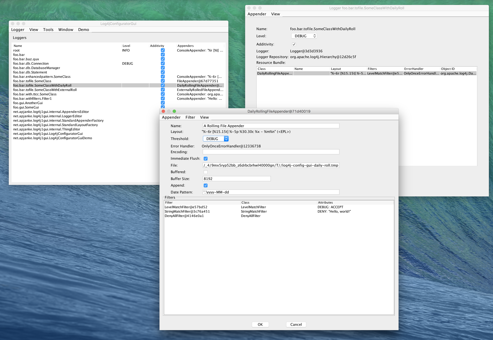

log4j-config-gui
============================

This is a configuration GUI for Apache Log4j 1.2.

It supports in-process configuration of Log4j in the current program, so it's useful for GUI applications that use Log4j. It does not support configuration of Log4j in external processes.



##  Usage

To get the library from Maven Central, include this in your project's `pom.xml`.

```
    <dependencies>
        <dependency>
            <groupId>net.apjanke.log4j-config-gui</groupId>
            <artifactId>log4j1-config-gui</artifactId>
            <version>0.1.1</version>
        </dependency>
    </dependencies>
```

Or download the [distribution](https://github.com/apjanke/log4j-config-gui/releases) and manually add it to your project.

Then, in your program, create and display a `Log4jConfiguratorGui`.

```
        SwingUtilities.invokeLater(new Runnable() {
            @Override
            public void run() {
                Log4jConfiguratorGui gui = new Log4jConfiguratorGui();
                gui.initializeGui();
                JFrame frame = gui.showInFrame();
                frame.setVisible(true);
            }
        }
```

See the `net.apjanke.log4j1gui.Log4jConfiguratorGuiDemo` example program in the distribution for more details.

Don't touch the `net.apjanke.log4j1gui.internal` stuff. Like the name says, that's for internal use only.

##  Author

`log4j-config-gui` is developed by [Andrew Janke](https://apjanke.net). The project home page is the [log4j-config-gui repo on GitHub](https://github.com/apjanke/log4j-config-gui).

This is not an official Apache project. This is just something I wrote that works with Log4j.
